# AI Widget Studio

<p align="center">
  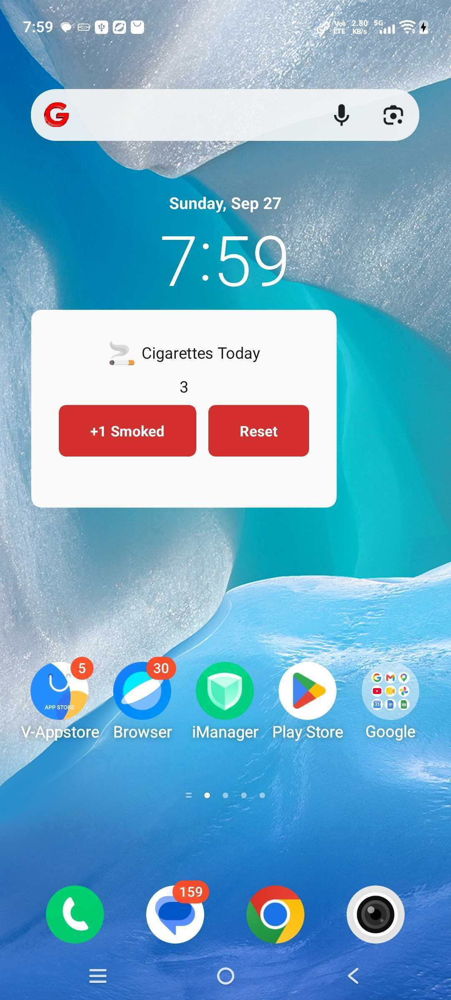
  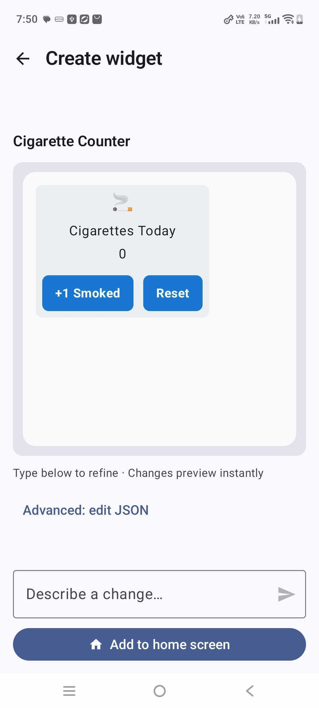
  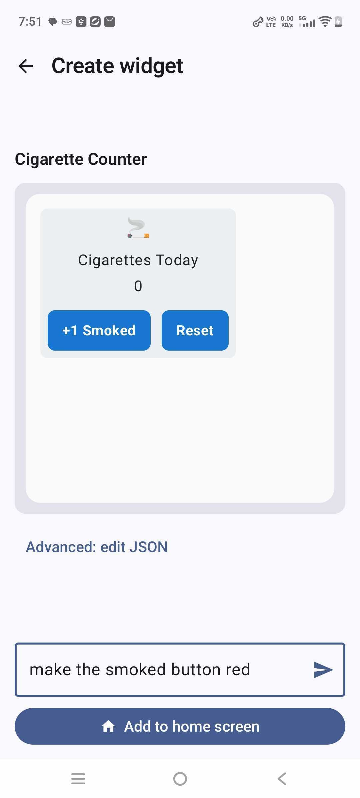
</p>
<p align="center">
  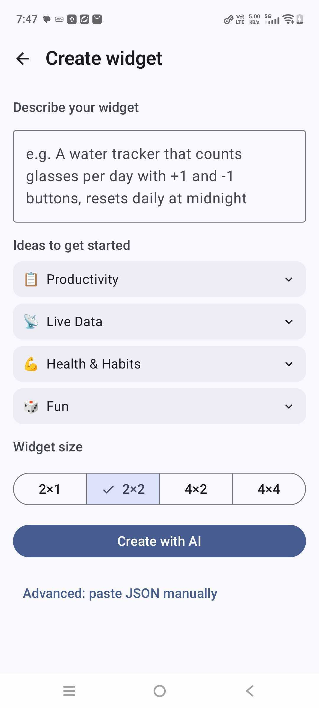
  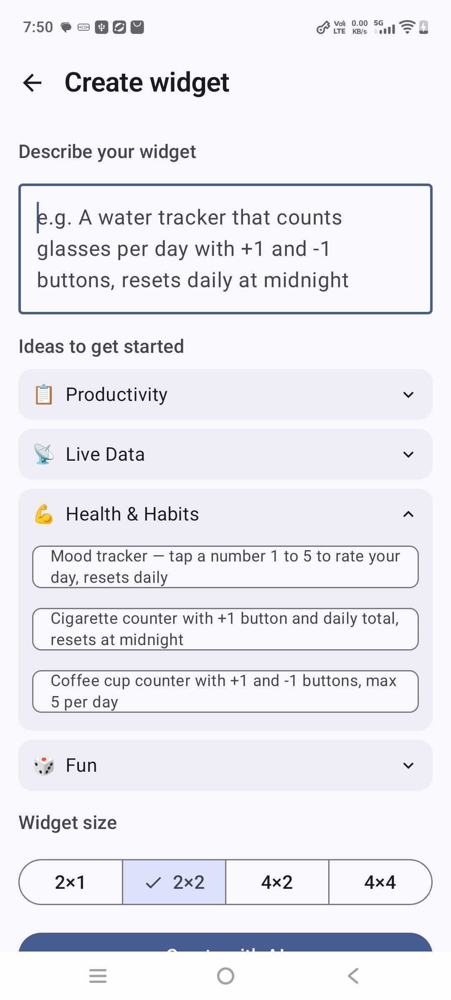
  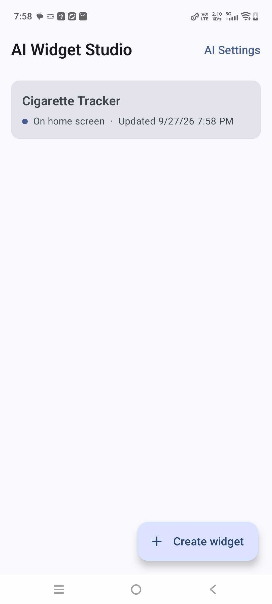
</p>

Android app for creating functional home-screen widgets from natural-language prompts. AI Widget Studio turns a prompt into a JSON widget DSL, validates it, previews it, and renders the result as an interactive Jetpack Glance widget.

## What It Does

- Generate a widget from a plain-English prompt or paste JSON manually.
- Preview the generated widget before adding it to the home screen.
- Refine an existing widget with follow-up prompts.
- Choose cloud generation with Gemini or local generation with an imported/downloaded on-device model.
- Create local stateful widgets with buttons, persistent values, and daily or periodic resets.
- Read supported Android data sources, including missed calls, calendar events, and app screen time, after the required permissions are granted.
- Apply conditional styling, such as changing a widget's color when a value crosses a threshold.

## Screenshots

<p align="center">
  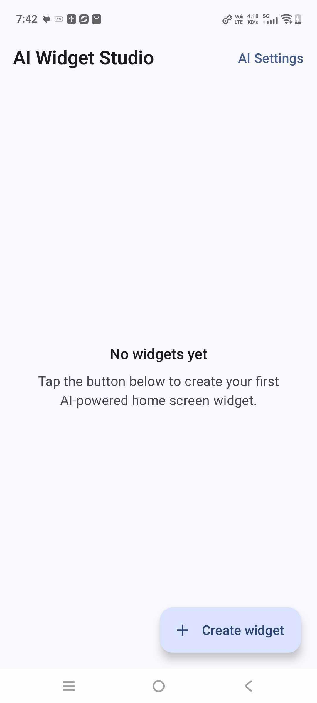
  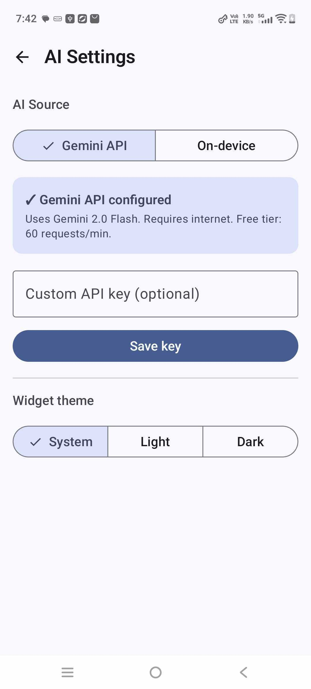
  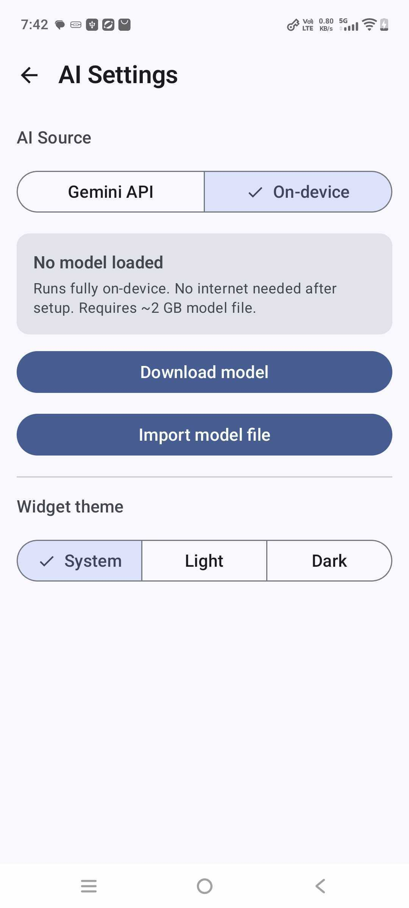
  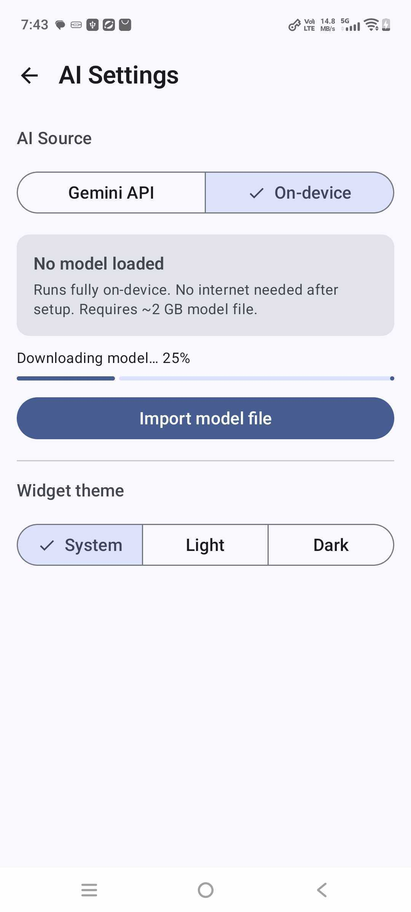
</p>
<p align="center">
  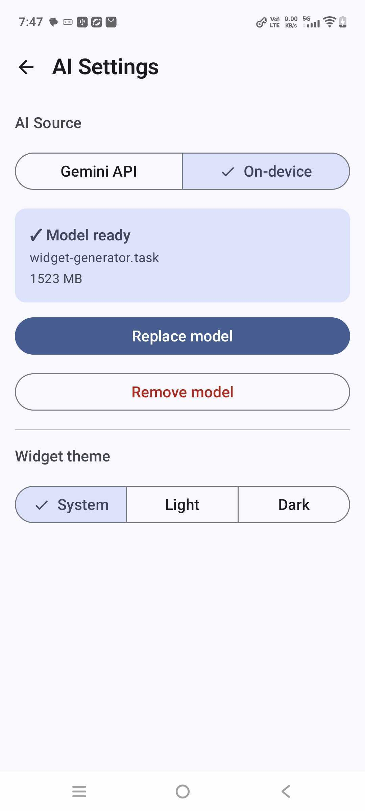
  
  
  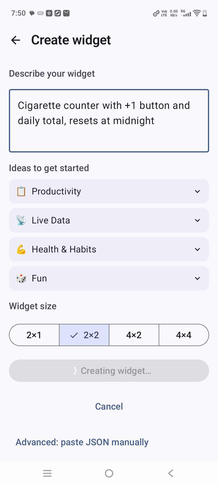
</p>
<p align="center">
  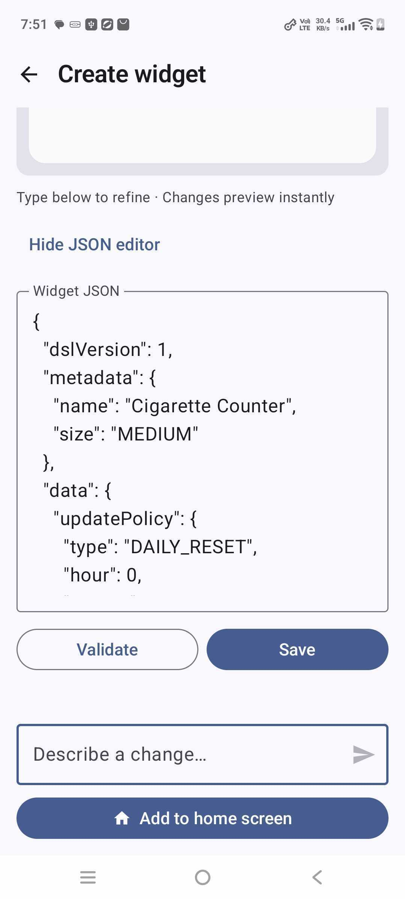
  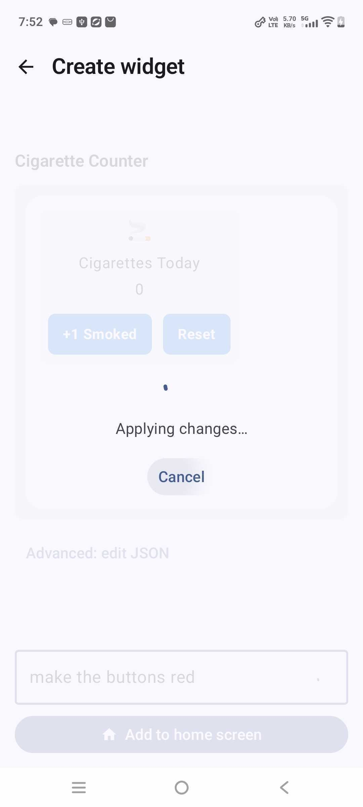
</p>

## How It Works

```text
User prompt
    -> Gemini or on-device model
    -> JSON widget DSL
    -> parser, mapper, and validator
    -> typed WidgetDefinition + persisted WidgetState
    -> Jetpack Glance home-screen widget
```

The runtime does not generate Kotlin code. The DSL describes data, actions, styles, and a recursive UI tree. The engine owns parsing, validation, state transitions, persistence, and rendering.

## Architecture

| Area | Responsibility |
| --- | --- |
| `ai` | Gemini and local-model generation, model download/import, prompt handling |
| `engine` | DSL parsing, mapping, validation, conditions, state, and runtime actions |
| `domain` | Typed models for widget definitions, variables, actions, UI nodes, and data sources |
| `data` | Room persistence, Android data-source resolvers, and permissions |
| `glance` | Recursive DSL-to-Glance rendering and widget refreshes |
| `worker` | Background data refreshes and scheduled state resets |
| `presentation` | Compose screens, preview, creation, refinement, and settings |

## Example Prompts

| Prompt | Result |
| --- | --- |
| `Water intake tracker with + and - buttons, resets daily at midnight` | Local counter with persistent state and a daily reset |
| `Show my next calendar event and minutes until it starts` | Calendar-backed widget with a live countdown |
| `Instagram screen time today in minutes` | Usage-statistics widget for a selected app |
| `Missed calls widget that turns red when count is greater than 0` | Call-log widget with conditional styling |
| `Cigarette counter with a +1 button and daily total` | Stateful tracker with an interactive home-screen button |

## DSL Example

```json
{
  "dslVersion": 1,
  "metadata": { "name": "Water Tracker", "size": "MEDIUM" },
  "data": {
    "updatePolicy": { "type": "DAILY_RESET", "hour": 0, "minute": 0 },
    "variables": [
      { "name": "glasses", "type": "INT", "default": 0, "min": 0, "max": 8 }
    ]
  },
  "actions": [
    { "id": "drink", "type": "INCREMENT", "target": "glasses", "step": 1 }
  ],
  "ui": {
    "type": "COLUMN",
    "children": [
      { "type": "TEXT", "value": "{{glasses}} / 8 glasses" },
      { "type": "PROGRESS", "current": "{{glasses}}", "max": "8" },
      { "type": "BUTTON", "text": "Drink", "action": "drink" }
    ]
  }
}
```

## Tech Stack

| Layer | Technology |
| --- | --- |
| UI | Kotlin, Jetpack Compose, Material 3 |
| Home-screen widgets | Jetpack Glance |
| Dependency injection | Hilt |
| Storage | Room and DataStore |
| Background work | WorkManager |
| AI | Gemini Android SDK, MediaPipe LLM Inference, LiteRT-LM |
| Serialization | kotlinx.serialization |
| State and concurrency | StateFlow, Coroutines, Mutex |

## Build And Run

1. Clone the repository.
2. Open it in Android Studio.
3. For Gemini generation, add a key to `local.properties`:

   ```properties
   GEMINI_API_KEY=your_key_here
   ```

4. Build and run on a device or emulator running Android API 24 or newer.
5. For offline generation, open **AI Settings** and download or import a compatible local model.

The app also works without a Gemini key when you use a local model or the manual JSON editor.
